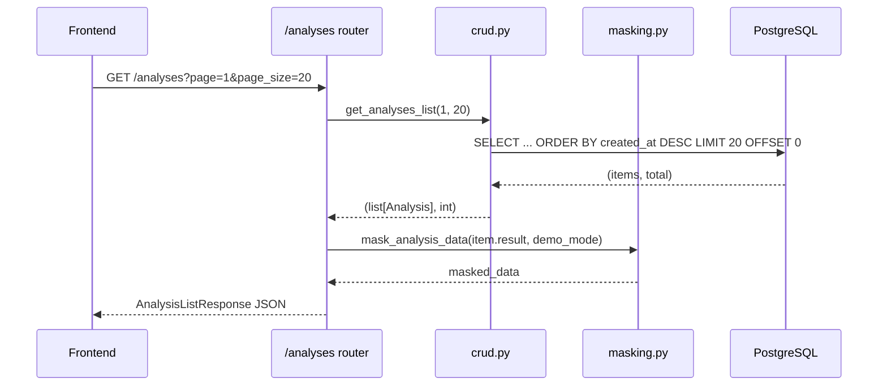

# Дизайн: analysis-history-visualization

## Обзор

Фича добавляет в NeoFin AI полноценный API истории анализов и подключает frontend к реальным данным вместо localStorage/mockHistory. Параллельно вводится модуль маскировки данных для демо-режима и улучшается визуализация коэффициентов на странице детального отчёта.

Четыре направления изменений:
1. **Backend API** — два новых эндпоинта: `GET /analyses` (список с пагинацией) и `GET /analyses/{task_id}` (детали).
2. **CRUD + схемы** — новая функция `get_analyses_list()` и три Pydantic v2 схемы.
3. **Маскировка** — чистая функция `mask_analysis_data()` в `src/utils/masking.py`.
4. **Frontend** — переписать `AnalysisHistory.tsx` на реальный API, улучшить `DetailedReport.tsx`.

---

## Архитектура

Изменения строго следуют существующим архитектурным правилам:

```
AnalysisHistory.tsx / DetailedReport.tsx
        │ axios (X-API-Key)
        ▼
src/routers/analyses.py          ← новый роутер (только валидация + вызов CRUD)
        │
        ├─ get_analyses_list(page, page_size)   ← новая CRUD-функция
        └─ get_analysis(task_id)                ← существующая CRUD-функция
        │
        ▼
src/db/crud.py                   ← единственное место с SQL
        │
        ▼
PostgreSQL: таблица analyses
        │
        ▼
src/utils/masking.py             ← применяется в роутере после чтения из БД
```

Новый роутер подключается в `src/app.py` по аналогии с существующими.



---

## Компоненты и интерфейсы

### Backend

**`src/routers/analyses.py`** — новый роутер

```python
GET /analyses
  Query params: page: int = 1, page_size: int = Query(20, le=100)
  Auth: Depends(get_api_key)
  Returns: AnalysisListResponse

GET /analyses/{task_id}
  Path param: task_id: str
  Auth: Depends(get_api_key)
  Returns: AnalysisDetailResponse
  Errors: 404 если не найден
```

Роутер не содержит бизнес-логики — только валидация параметров, вызов CRUD, применение маскировки, формирование ответа.

**`src/db/crud.py`** — новая функция

```python
async def get_analyses_list(
    page: int,
    page_size: int
) -> tuple[list[Analysis], int]:
    """
    SELECT id, task_id, status, result, created_at
    FROM analyses
    ORDER BY created_at DESC
    LIMIT page_size OFFSET (page - 1) * page_size;

    SELECT COUNT(*) FROM analyses;
    """
```

**`src/utils/masking.py`** — новый модуль

```python
def mask_analysis_data(data: dict, demo_mode: bool) -> dict:
    """Чистая функция. Без импортов FastAPI/SQLAlchemy."""
```

**`src/models/schemas.py`** — три новые схемы

```python
class AnalysisSummaryResponse(BaseModel):
    task_id: str
    status: str
    created_at: datetime
    score: float | None
    risk_level: str | None
    filename: str | None

class AnalysisListResponse(BaseModel):
    items: list[AnalysisSummaryResponse]
    total: int
    page: int
    page_size: int

class AnalysisDetailResponse(BaseModel):
    task_id: str
    status: str
    created_at: datetime
    data: dict | None
```

### Frontend

**`frontend/src/api/interfaces.ts`** — добавить два интерфейса

```typescript
export interface AnalysisSummary {
  task_id: string;
  status: string;
  created_at: string;       // ISO 8601
  score: number | null;
  risk_level: string | null;
  filename: string | null;
}

export interface AnalysisListResponse {
  items: AnalysisSummary[];
  total: number;
  page: number;
  page_size: number;
}
```

**`frontend/src/pages/AnalysisHistory.tsx`** — переписать

- Убрать `useHistory` / `mockHistory` как источник данных для отображения списка
- `useEffect` при монтировании → `GET /analyses?page=X&page_size=20`
- При клике на строку → `GET /analyses/{task_id}` → передать `data` в `DetailedReport`
- Состояния: `loading`, `error`, `items`, `total`, `page`
- Пагинация через компонент `Pagination` из Mantine

**`frontend/src/pages/DetailedReport.tsx`** — улучшить BarChart

- Убрать `historicalData` (захардкоженные данные за 2023–2025)
- Построить данные для `BarChart` из `result.ratios` (только ненулевые значения)
- Словарь маппинга EN-ключей → русские названия
- Цвет столбца: `teal.6` если значение ≥ порогового, `red.5` иначе
- При < 2 ненулевых коэффициентов — показать текст вместо графика

---

## Модели данных

### Существующая ORM-модель `Analysis`

Согласно `src/db/models.py` (актуальная версия):

```
id          Integer PK
task_id     String(64) UNIQUE INDEX
status      String(32)
result      JSONB nullable
created_at  DateTime(timezone=True) server_default=now()
```

> Примечание: поля `filename`, `error_message`, `updated_at` упомянуты в требованиях, но отсутствуют в текущей модели. Роутер будет извлекать `filename` из `result['filename']` (если есть) — без изменения схемы БД.

### Структура `result` JSONB (из `src/tasks.py`)

```json
{
  "status": "completed",
  "filename": "report.pdf",
  "data": {
    "scanned": false,
    "text": "...",
    "tables": [],
    "metrics": { "revenue": 1000000, ... },
    "ratios": { "current_ratio": 1.5, "roa": 0.08, ... },
    "score": {
      "score": 72.5,
      "risk_level": "medium",
      "factors": [...],
      "normalized_scores": {...}
    },
    "nlp": { "risks": [], "key_factors": [], "recommendations": [] }
  }
}
```

### Логика извлечения полей для `AnalysisSummaryResponse`

```python
score = analysis.result.get("data", {}).get("score", {}).get("score") if analysis.result else None
risk_level = analysis.result.get("data", {}).get("score", {}).get("risk_level") if analysis.result else None
filename = analysis.result.get("filename") if analysis.result else None
```

### Правила маскировки (`src/utils/masking.py`)

При `demo_mode=True`:
- Поля `metrics` и `ratios` в `data`: все числовые значения заменяются на строку-маску
- Поле `text` в `data`: заменяется на `"[DEMO: текст скрыт]"`
- Поля `score`, `risk_level`, `factors`, `normalized_scores`, `nlp` — **не изменяются**
- При `demo_mode=False`: данные возвращаются без изменений

Формат маски: сохранять знак и порядок величины, заменять значащие цифры на `X`.
Примеры: `1234567.89` → `"X,XXX,XXX"`, `0.85` → `"X.XX"`, `-42.1` → `"-XX.X"`.

### Пороговые значения для цветового кодирования (frontend)

```typescript
const THRESHOLDS: Partial<Record<keyof FinancialRatios, number>> = {
  current_ratio: 2.0,
  quick_ratio: 1.0,
  roa: 0.05,
  roe: 0.10,
  equity_ratio: 0.5,
};
```

---

## Correctness Properties

*A property is a characteristic or behavior that should hold true across all valid executions of a system — essentially, a formal statement about what the system should do. Properties serve as the bridge between human-readable specifications and machine-verifiable correctness guarantees.*

### Property 1: Структура ответа GET /analyses

*For any* набора записей в БД, ответ `GET /analyses` должен содержать объект с полями `items` (массив), `total` (целое число), `page` (целое число), `page_size` (целое число), и каждый элемент `items` должен содержать поля `task_id`, `status`, `created_at`, `score`, `risk_level`, `filename`.

**Validates: Requirements 1.2, 1.4**

### Property 2: Сортировка по created_at DESC

*For any* набора из N ≥ 2 записей в БД с различными значениями `created_at`, ответ `GET /analyses` должен возвращать элементы в порядке убывания `created_at` (первый элемент — самый новый).

**Validates: Requirements 1.5**

### Property 3: Корректность пагинации CRUD

*For any* значений `page` ≥ 1 и `page_size` от 1 до 100, функция `get_analyses_list(page, page_size)` должна возвращать кортеж `(items, total)`, где `total` равен общему числу записей в БД, а `len(items)` ≤ `page_size`.

**Validates: Requirements 1.3, 1.8**

### Property 4: Round-trip GET /analyses/{task_id}

*For any* записи `Analysis`, созданной в БД с определёнными `task_id`, `status` и `result`, запрос `GET /analyses/{task_id}` должен возвращать объект с теми же значениями `task_id`, `status` и `data` (равным `result`).

**Validates: Requirements 2.2**

### Property 5: Маскировка числовых значений

*For any* словаря `data` с полями `metrics` и `ratios`, содержащими числовые значения, вызов `mask_analysis_data(data, True)` должен возвращать словарь, в котором все числовые значения в `metrics` и `ratios` заменены на нечисловые (строки-маски), а поля `score`, `risk_level`, `factors`, `normalized_scores`, `nlp` остаются идентичными исходным.

**Validates: Requirements 4.1, 4.4**

### Property 6: Identity при demo_mode=False

*For any* словаря `data`, вызов `mask_analysis_data(data, False)` должен возвращать словарь, идентичный входному (без каких-либо изменений).

**Validates: Requirements 4.5**

### Property 7: Идемпотентность маскировки

*For any* словаря `data`, двойной вызов `mask_analysis_data(mask_analysis_data(data, True), True)` должен возвращать результат, эквивалентный однократному вызову `mask_analysis_data(data, True)`.

**Validates: Requirements 4.8**

### Property 8: Данные BarChart из реальных ratios

*For any* объекта `AnalysisData.ratios` с N ненулевыми коэффициентами (N ≥ 2), данные, переданные в `BarChart`, должны содержать ровно N элементов, каждый из которых соответствует ненулевому коэффициенту из `ratios`.

**Validates: Requirements 5.1, 5.2**

### Property 9: Цветовое кодирование столбцов

*For any* коэффициента из `FinancialRatios` с определённым пороговым значением, цвет столбца в `BarChart` должен быть `teal.6` если значение ≥ порогового, и `red.5` если значение < порогового.

**Validates: Requirements 5.7**

### Property 10: Round-trip форматирования даты

*For any* строки `created_at` в формате ISO 8601, полученной от API, функция форматирования на frontend должна возвращать строку в формате `DD.MM.YYYY` без потери информации о дате (день, месяц, год должны совпадать с исходными).

**Validates: Requirements 3.6, 6.5**

---

## Обработка ошибок

### Backend

| Ситуация | HTTP-код | Сообщение |
|---|---|---|
| Невалидный/отсутствующий X-API-Key | 401/403 | Стандартный ответ `get_api_key` |
| `task_id` не найден | 404 | `"Analysis not found"` |
| Нечисловой `page` или `page_size` | 422 | Автоматически FastAPI/Pydantic |
| `page_size` > 100 | 422 | Автоматически через `Query(le=100)` |
| Ошибка БД | 500 | `"Internal server error"` (логируется) |

### Frontend

| Ситуация | Поведение |
|---|---|
| Загрузка данных | Skeleton-индикатор |
| Ошибка запроса | Сообщение об ошибке + кнопка "Повторить" |
| `score` или `risk_level` = null | Отображать `"—"` |
| < 2 ненулевых коэффициентов | Текст "Недостаточно данных для построения графика" |
| Ошибка загрузки деталей | Уведомление через Mantine notifications |

---

## Стратегия тестирования

### Подход

Используется двойной подход: **unit-тесты** для конкретных примеров и граничных случаев, **property-based тесты** для универсальных свойств.

- Unit-тесты: конкретные примеры, edge cases, интеграционные точки
- Property-тесты: универсальные свойства на случайных входных данных

### Property-based тестирование

**Библиотека**: `hypothesis` (Python) — уже используется в экосистеме проекта, не требует установки дополнительных зависимостей.

**Конфигурация**: минимум 100 итераций на каждый тест (`@settings(max_examples=100)`).

**Теги**: каждый property-тест должен содержать комментарий:
```python
# Feature: analysis-history-visualization, Property N: <текст свойства>
```

**Каждое свойство реализуется одним property-based тестом.**

### Тесты backend (`tests/test_analyses_router.py`, `tests/test_masking.py`, `tests/test_crud_analyses.py`)

**Unit-тесты:**
- `GET /analyses` без X-API-Key → 401/403
- `GET /analyses/{task_id}` с несуществующим task_id → 404
- `GET /analyses?page=abc` → 422
- `GET /analyses?page_size=101` → 422
- `mask_analysis_data({}, False)` → `{}`
- `mask_analysis_data` с пустыми metrics/ratios → без ошибок

**Property-тесты:**
```python
# Property 1: Структура ответа GET /analyses
@given(st.lists(analysis_strategy(), min_size=0, max_size=50))
@settings(max_examples=100)
def test_analyses_list_response_structure(analyses):
    # Feature: analysis-history-visualization, Property 1: структура ответа GET /analyses
    ...

# Property 2: Сортировка по created_at DESC
@given(st.lists(analysis_strategy(), min_size=2, max_size=20))
@settings(max_examples=100)
def test_analyses_sorted_by_created_at_desc(analyses):
    # Feature: analysis-history-visualization, Property 2: сортировка по created_at DESC
    ...

# Property 3: Корректность пагинации CRUD
@given(
    st.integers(min_value=1, max_value=10),
    st.integers(min_value=1, max_value=100),
    st.lists(analysis_strategy(), min_size=0, max_size=200)
)
@settings(max_examples=100)
def test_get_analyses_list_pagination(page, page_size, analyses):
    # Feature: analysis-history-visualization, Property 3: корректность пагинации CRUD
    ...

# Property 4: Round-trip GET /analyses/{task_id}
@given(analysis_strategy())
@settings(max_examples=100)
def test_get_analysis_detail_roundtrip(analysis):
    # Feature: analysis-history-visualization, Property 4: round-trip GET /analyses/{task_id}
    ...

# Property 5: Маскировка числовых значений
@given(analysis_data_strategy())
@settings(max_examples=100)
def test_mask_replaces_numbers_preserves_score(data):
    # Feature: analysis-history-visualization, Property 5: маскировка числовых значений
    ...

# Property 6: Identity при demo_mode=False
@given(analysis_data_strategy())
@settings(max_examples=100)
def test_mask_identity_when_demo_false(data):
    # Feature: analysis-history-visualization, Property 6: identity при demo_mode=False
    ...

# Property 7: Идемпотентность маскировки
@given(analysis_data_strategy())
@settings(max_examples=100)
def test_mask_idempotent(data):
    # Feature: analysis-history-visualization, Property 7: идемпотентность маскировки
    ...
```

### Тесты frontend (`frontend/src/pages/__tests__/`)

**Unit-тесты (React Testing Library + Vitest):**
- `AnalysisHistory` при монтировании делает вызов к `GET /analyses`
- `AnalysisHistory` отображает skeleton при `loading=true`
- `AnalysisHistory` отображает ошибку + кнопку "Повторить" при ошибке API
- `AnalysisHistory` отображает пагинацию при `total > page_size`
- `AnalysisHistory` отображает `"—"` для null `score` и `risk_level`
- `DetailedReport` отображает "Недостаточно данных" при < 2 ненулевых коэффициентах

**Property-тесты (fast-check):**
```typescript
// Property 8: Данные BarChart из реальных ratios
// Feature: analysis-history-visualization, Property 8: данные BarChart из реальных ratios
fc.assert(fc.property(ratiosArbitrary, (ratios) => {
  const chartData = buildChartData(ratios);
  const nonZeroCount = Object.values(ratios).filter(v => v !== null && v !== 0).length;
  return chartData.length === nonZeroCount;
}), { numRuns: 100 });

// Property 9: Цветовое кодирование столбцов
// Feature: analysis-history-visualization, Property 9: цветовое кодирование столбцов
fc.assert(fc.property(ratioWithThresholdArbitrary, ({ key, value, threshold }) => {
  const color = getBarColor(key, value);
  return value >= threshold ? color === 'teal.6' : color === 'red.5';
}), { numRuns: 100 });

// Property 10: Round-trip форматирования даты
// Feature: analysis-history-visualization, Property 10: round-trip форматирования даты
fc.assert(fc.property(isoDateArbitrary, (isoDate) => {
  const formatted = formatDate(isoDate);
  const [day, month, year] = formatted.split('.');
  const original = new Date(isoDate);
  return (
    parseInt(day) === original.getDate() &&
    parseInt(month) === original.getMonth() + 1 &&
    parseInt(year) === original.getFullYear()
  );
}), { numRuns: 100 });
```

**Конфигурация fast-check**: `numRuns: 100` для каждого property-теста.
